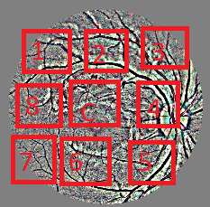
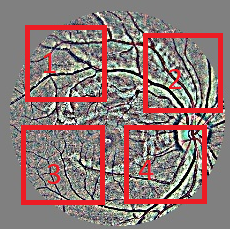
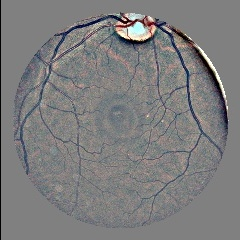
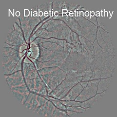

# Comparative study of self-supervised approaches applied to ocular images

### Description
This works pretends to apply Self Supervised training to improve diabetic retinopathy level prediction.
These are the Self Supervised works implemented:
- __Context Prediction__:   
  
The model will predict the position of a pair madre of a patch (1,2,3,4,5,6,7,8) and its center (C)
- __Jiggsaw__:  
  
The model will permutate up to four patchs (1,2,3,4) and will predict wich permutation is applied. The algorithm get those permutations with the maximum Hamming distance.
- __Rotation__:  
  
Images will be rotated in [0,90,-90] degrees, so the model will predict the rotation angle. This work usually rotate images in [0,90,180,270] degrees but with eye images its not recomended because the model may confuse rigth eye and left eye.

# Required software and libraries

- Python 3.6
- NVIDIA CUDA 10.0
- NVIDIA cuDNN 7.4.1
- Keras 2.3.1
- TensorFlow-GPU 2.0
- TensorBoard 2.0.2
- OpenCV 4.2.0
- Pandas 1.0.3
- Scikit-Learn 0.23.0
- Numpy 1.18.4
- Pickle 1.4.0
- Matplotlib 3.2.1
- Click 7.1.2

For compatibility reasons, you must use the exact Python, Keras, CUDA, cuDNN and TensorFlow versions listed, for the other libraries you can use the latest version if you want.

# Usage
First, you have to prepare the data for training each Self-Supervised approach, so go to the terminal and launch:

```sh
$ python ./datasetCreation/main.py
```
Now you will see the main menu where you can access all the options for data generation.
It is recommended to follow the next steps:
 - Preprocess the entire set of images
 - Resize the entire set of images
 - Prepare the data for each Self-Supervised training:
     - For Context Prediction and Jiggsaw you will need to make aditional train/validation splits, those files will be saved automatically in ContextPrediction folder and Jiggsaw Folder and will be read automatically when you launch those trainings.
     - This step is not required for the Rotation method.
 - To predict diabetic retinopathy levels, you must categorize your images first, then you should apply oversampling and undersamplig following the options in the main menu.  
Now you can train each Self-Supervised method, so you can launch those commands on the terminal:

 * __Context Prediction__:
```sh
$ python ./contextPrediction/contextPrediction.py 
```
 * __Jiggsaw__:
```sh
$ python ./jiggsaw/jiggsaw.py
```
 * __Rotation__:
```sh
$ python ./rotation/rotation.py
```
Remember that those executions need arguments to work, so you can use ``` --help ``` to get a list with all the arguments. Most of them are set by default, so you will have to worry about the img size and train/validation splits in case of Rotation.

Now you can import the weights that you got in Self-Supervised to train a model for diabetic retinopathy level prediction. Those weights will be automatically saved in the same Self-Supervised folder after training. (Before this, remember to go to the main menu and select 'Categorize Dataset' option to categorize diabetic retinopathy images in folders).
So you can go to the terminal and launch this:

```sh
$ python ./trainTest/trainVGG16.py -l -w 'path to the weights'
```
Remember, you can use ``` --help ``` command to see more arguments.

Also each training generates a training history and a model file, so you can use that model file to watch the metrics executing:
```sh
$ python ./trainTest/getModelReport.py -V 'path to test split' -M 'path to model file'
```
Also you can enter ``` --help ``` to see all the arguments that you can use.

# Demo  
If you want to make a prediction, you can use some of your trained models or download one from [here](https://1drv.ms/u/s!AlU_JdEj3rnUhfEpl0eY2Zy-1prdyQ?e=EswAvb). To do this, go to ./trainTest/demo.py and launch the script. You can use this parameters:

| Paremeter                    | Description                                                                    | Command | Default    | Options                                                             |
|------------------------------|--------------------------------------------------------------------------------|---------|------------|---------------------------------------------------------------------|
| Test image                  | Path to a test img                                                       | -t      | None       | None                                                                |
| Model File                   | Path to your model file                                                        | -M      | None       | None                                                                |
| Classification or Regression | Use this argument to distinguish  between classification and regression models | -c      | Regression | Type -c for classification, do not type the argument for regression |

Remember that your test images also need to be preprocessed, but the dont have to be in the train split.  
For example:  
```sh
$ python ./trainTest/demo.py -t ./data/test/class1/img2.jpg  -M 'path to model file' -c
```
After the execution, you will see the image with the prediction printed in:  
  

# Credits
- __Carlos de la Barrera Pérez__ - Lead Developer - [GitHub](https://github.com/xXNukem/)
- __Dr. Manuel Jesús Marín Jiménez__ - Advisor - [GitHub](https://github.com/mjmarin)
- __Dr. Rafel Giménez Gomez__ - Advisor
